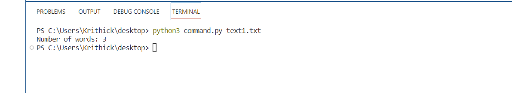

# Command-line-arguments-to-count-word
## AIM:
To write a python program for getting the word count from the contents of a file using command line arguments.
## EQUIPEMENT'S REQUIRED: 
PC
Anaconda - Python 3.7
## ALGORITHM: 
### Step 1:
Create a new file in visual studio code and type the words in that file.
### Step 2: 
 Save the file and after opening new folder type the required code to generate the program.
### Step 3: 
import sys from the module.
### Step 4:  
Split the word count using command line arguments.
### Step 5: 
print the len(words()).
### Step 6: 
End the Program.
## PROGRAM:
```python
import sys
f=open(sys.argv[1],'r')
a=f.read().split()
word=len(a)
print("Number of words:",word)
```

### OUTPUT:
1) Coding


2) Textfile


3) Output



## RESULT:

Thus the program is written to find the word count from the contents of a file using command line arguments.
